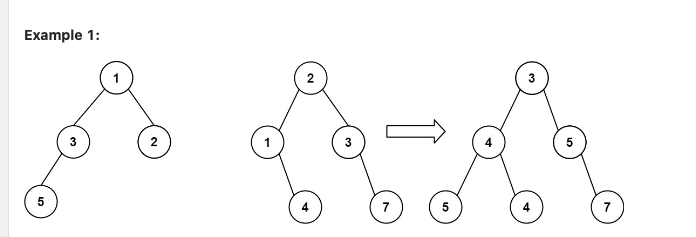

Input: root1 = [1,3,2,5], root2 = [2,1,3,null,4,null,7]
Output: [3,4,5,5,4,null,7]

leetcode：617
两个树重叠的node要相加，不重叠的部分就


一般选择前序遍历

```python
class TreeNode:
    def __init__(self, val, next=None):
        self.val = val
        self.next = next
def mergeTrees(root1, root2):
    # 处理两个二叉树的终止条件
    if root1 is None:
        return root2
    if root2 is None:
        return root1
    
    cur_val = root1.val + root2.val
    # 直接改tree1的结构
    root1.val = cur_val
    root1.left = mergeTrees(root1.left, root2.left)
    root1.right = mergeTrees(root1.right, root2.right)
    return root1
    
```