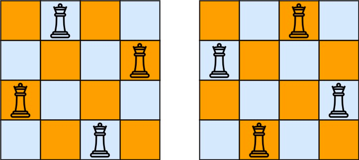

The n-queens puzzle is the problem of placing n queens 
on an n x n chessboard 
such that no two queens attack each other.

Given an integer n, return all distinct solutions to the n-queens puzzle. 
You may return the answer in any order.

Each solution contains a distinct board configuration of the n-queens' 
placement, where 'Q' and '.' both indicate a queen and an empty space, 
respectively.

Example 1:


Input: n = 4

Output: [[".Q..","...Q","Q...","..Q."],["..Q.","Q...","...Q",".Q.."]]
Explanation: There exist two distinct solutions to the 4-queens puzzle as shown above
Example 2:

Input: n = 1
Output: [["Q"]]

n皇后问题，给一个n*n的棋盘，
棋盘上有n个皇后，同一列、同一行、斜对角都不能同时出现两个皇后
否则皇后就会打架
给定n，问最多有几种解决方案，将所有的结果返回

递归 - n*n就递归n层

树的高度就是行数
3*3的n皇后问题是无解的


```python
class Solution:
    def __int__(self):
        # 三维数组
        self.result = []
    def solveNQueens(self, n: int) -> List[List[str]]:
        chess_board = ['.' * n for _ in range(n)]
        self.backTracking(n, chess_board, 0, self.result)
    def backTracking(self, n, chess_board, row, result):
        # 到了叶子节点，不合法的结果在走这步之前就被卡掉了
        if row == n:
            result.append(chess_board[:])
            return
        
        for col in n:
            if self.isValid(row, col, chess_board):
                # 放置皇后
                chess_board[row] = chess_board[row][:col] + "Q" +chess_board[row][col+1]
                self.backTracking(n, chess_board, +1, result)
                chess_board[row] = chess_board[row][:col] + '.' + chess_board[row][col+1]
    
    def isValid(self, row, col, chess_board):
          

```