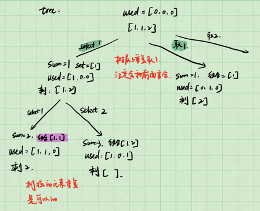

Given a collection of candidate numbers (candidates) and a target number (target), find all unique combinations in candidates where the candidate numbers sum to target.

Each number in candidates may only be used once in the combination.

Note: The solution set must not contain duplicate combinations.

 

Example 1:

Input: candidates = [10,1,2,7,6,1,5], target = 8
Output: 
[
[1,1,6],
[1,2,5],
[1,7],
[2,6]
]
Example 2:

Input: candidates = [2,5,2,1,2], target = 5
Output: 
[
[1,2,2],
[5]
]


组合问题2 - candidate里面有重复元素
组合问题的去重
不能把candidate里的元素去重，而是不能出现重复的组合

暴力法：把所有组合的方式搜索出来后去重 - 会超时
应该在搜索过程中直接去重


重点：树层去重，树枝去重

numbers: 1 1 2,  target = 3
注意： numbers 需要排序，排序就是为了让相邻的元素放在一起
树丛中，第二个相同的数就没必要再取了

用一个数组确定哪些数组使用过，哪些没有
used = [0, 0, 0]



```python
class Solution:
    def __init__(self):
        self.path = []
        self.result = []

    def combinationSum2(self, candidates: List[int], target: int) -> List[List[int]]:
        self.backTracking(candidates, target, 0, 0)
        return self.result

    def backTracking(self, candidates, target, sum_, start_index, used):
        if sum_ == target:
            self.result.append(self.path[:])
            return
        if sum_ > target:
            return
        
        for i in range(start_index, len(candidates)):
            if i > 0 and candidates[i] == candidates[i - 1] :
                return
            


```